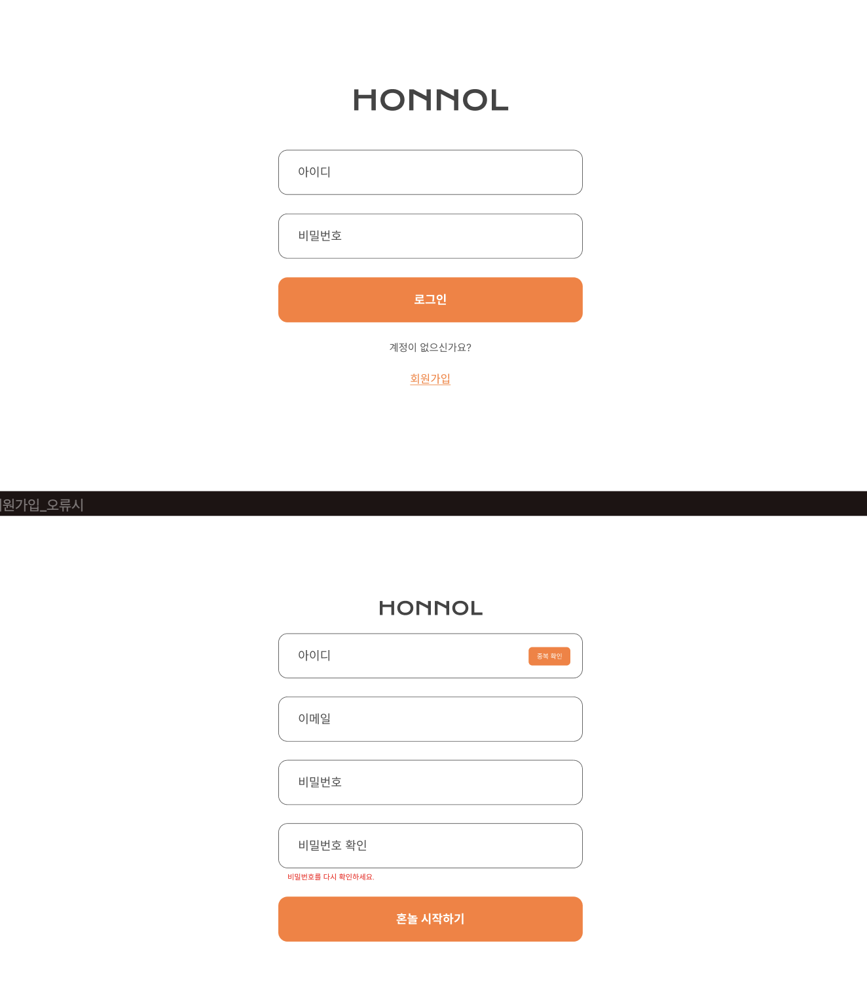
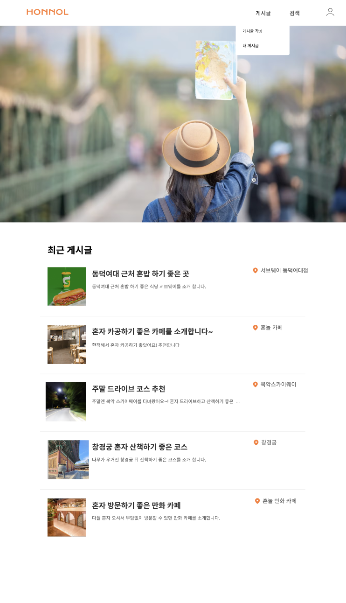
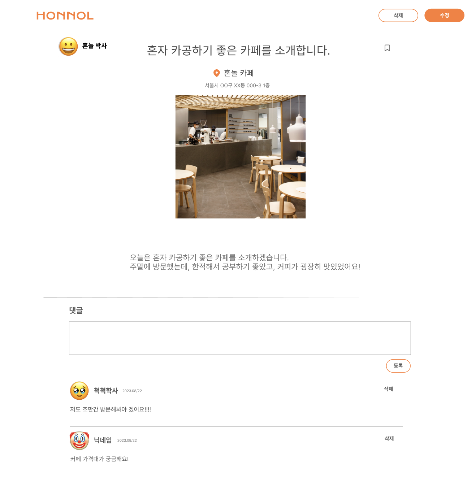
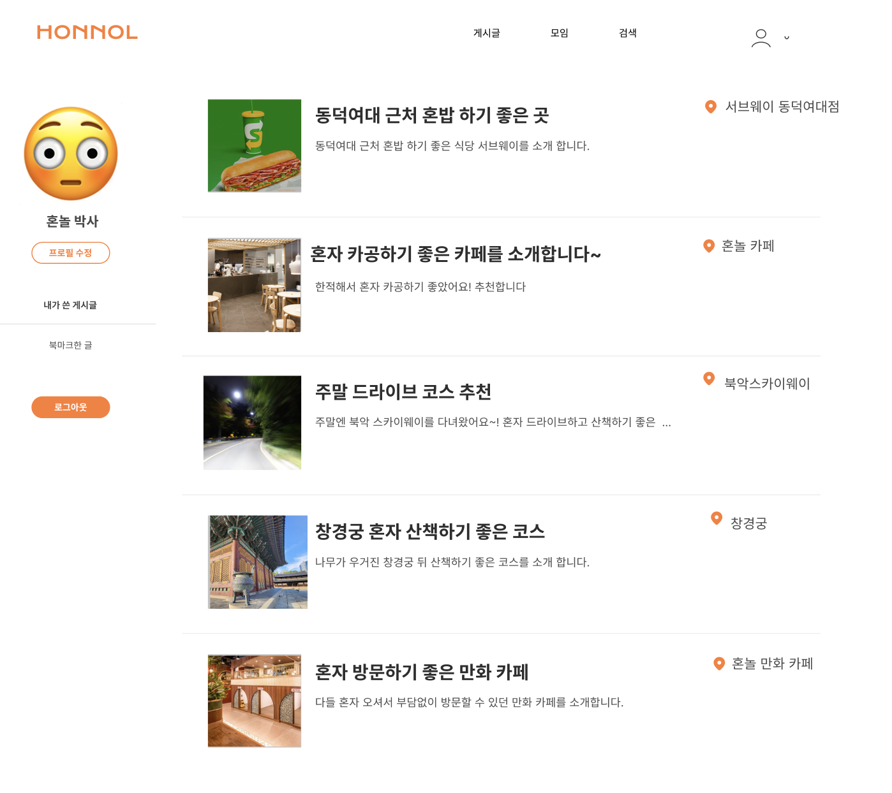

# Honnol

> ### Description
"혼자 잘 놀 수 있다" 라는 의미의 혼놀은 사용자가 혼자 방문한 장소를 공유하는 커뮤니티형 서비스입니다.  

> ### Developer 👩🏻‍💻

- [`Hszoo`](https://github.com/Hszoo)
- [`mk-star`](https://github.com/mk-star)
- [`Seyoung-Moon`](https://github.com/Seyoung-Moon)
- [`seha01130`](https://github.com/seha01130)  

> ### Tech Stack 🛠

- Laungage :  
- Database :   
> ### Result (2023.12.27 updated)
> `혼놀 노션페이지`  
https://www.notion.so/goorm-uuju/Honnol-b3ceccdba8d740eabb69f7294534f3b6?pvs=4 

 
  
  
  
  

